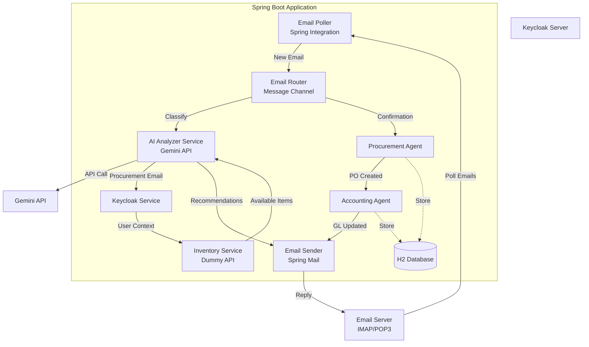

# Design Document: Procurement Email Automation System

## Overview

This POC system is a Spring Boot application that uses Spring Integration for email processing workflows. The system monitors a configured email inbox, uses Gemini AI to classify and extract procurement requests, integrates with Keycloak for user context, queries dummy inventory APIs, and orchestrates procurement workflows with simulated accounting updates.

### Key Technologies
- **Spring Boot 3.x**: Application framework
- **Spring Integration**: Email polling, message routing, and workflow orchestration
- **Spring Mail**: Email sending and receiving
- **Keycloak**: Identity and user management
- **Gemini API**: AI-powered email classification and analysis
- **H2 Database**: In-memory database for POC data persistence
- **RestTemplate/WebClient**: HTTP client for API calls

## Architecture

### High-Level Architecture



### Component Flow

1. **Email Polling**: Spring Integration polls the configured email account
2. **Email Classification**: Gemini AI classifies emails as procurement-related
3. **Context Gathering**: Keycloak provides requester role and preferences
4. **Inventory Check**: Dummy inventory API returns available items
5. **AI Recommendation**: Gemini analyzes and recommends items
6. **Email Reply**: System sends recommendations to requester
7. **Confirmation Processing**: System processes requester confirmation
8. **Procurement Flow**: Generate PO and update accounting
9. **Completion Notification**: Send final confirmation email

## Components and Interfaces

### 1. Email Integration Layer

#### EmailPollerConfig
```java
@Configuration
public class EmailPollerConfig {
    @Bean
    public IntegrationFlow emailPollingFlow(
        MailReceiver mailReceiver,
        EmailProcessingService emailService) {
        // Configure IMAP/POP3 polling with Spring Integration
        // Poll interval: 60 seconds
        // Mark emails as read after processing
    }
}
```

**Responsibilities:**
- Configure Spring Integration email inbound adapter
- Poll email server at 60-second intervals
- Convert email messages to internal format
- Track processed emails to prevent duplicates

#### EmailSenderService
```java
@Service
public class EmailSenderService {
    void sendRecommendationEmail(String to, List<Item> recommendations);
    void sendConfirmationEmail(String to, PurchaseOrder po);
    void sendErrorEmail(String to, String errorMessage);
}
```

**Responsibilities:**
- Send formatted email responses
- Template-based email generation
- Handle email delivery failures with retry logic

### 2. AI Analysis Layer

#### GeminiAIService
```java
@Service
public class GeminiAIService {
    boolean isProcurementRelated(EmailMessage email);
    ProcurementRequest extractRequestDetails(EmailMessage email);
    List<Item> recommendItems(
        ProcurementRequest request,
        UserContext userContext,
        List<Item> availableItems);
}
```

**Responsibilities:**
- Call Gemini API for email classification
- Extract item type, specifications, and quantity
- Analyze requester context for recommendations
- Consider role, designation, and preferences in decision-making

**API Integration:**
- Endpoint: Gemini API REST endpoint
- Authentication: API key in headers
- Timeout: 10 seconds
- Retry: 3 attempts with exponential backoff

### 3. Identity Management Layer

#### KeycloakIntegrationService
```java
@Service
public class KeycloakIntegrationService {
    Optional<UserContext> getUserByEmail(String email);
}

@Data
public class UserContext {
    private String email;
    private String role;
    private String designation;
    private Map<String, String> preferences;
}
```

**Responsibilities:**
- Query Keycloak for user information
- Extract role, designation, and preferences
- Handle user not found scenarios
- Cache user context for performance

**Integration:**
- Keycloak Admin REST API
- OAuth2 client credentials flow
- Connection pooling for performance

### 4. Inventory Management Layer

#### InventoryService (Dummy Implementation)
```java
@Service
public class InventoryService {
    List<Item> searchAvailableItems(String itemType, Map<String, String> specs);
}

@Data
public class Item {
    private String id;
    private String name;
    private String type;
    private Map<String, String> specifications;
    private int availableQuantity;
    private BigDecimal bookValue;
}
```

**Responsibilities:**
- Return mock inventory data based on item type
- Simulate inventory availability
- Provide item specifications and book values

**Mock Data:**
- Laptops: Dell XPS 15, MacBook Pro, ThinkPad X1
- Monitors: Dell UltraSharp, LG 4K, Samsung Curved
- Accessories: Keyboards, mice, headsets

### 5. Procurement Workflow Layer

#### ProcurementAgentService
```java
@Service
public class ProcurementAgentService {
    PurchaseOrder generatePurchaseOrder(
        ProcurementRequest request,
        UserContext requester);
}

@Entity
@Data
public class PurchaseOrder {
    @Id
    private String poNumber;
    private String itemName;
    private String itemType;
    private Map<String, String> specifications;
    private int quantity;
    private BigDecimal amount;
    private String requesterEmail;
    private String requesterRole;
    private LocalDateTime createdAt;
    private String status;
}
```

**Responsibilities:**
- Generate unique PO numbers
- Create purchase order records
- Persist PO data to database
- Notify accounting agent

### 6. Accounting Layer

#### AccountingAgentService
```java
@Service
public class AccountingAgentService {
    void recordInventoryAllocation(Item item, UserContext requester);
    void recordPurchaseTransaction(PurchaseOrder po);
}

@Entity
@Data
public class GeneralLedgerEntry {
    @Id
    private Long id;
    private String transactionType; // ALLOCATION or PURCHASE
    private String accountDebit;
    private String accountCredit;
    private BigDecimal amount;
    private String referenceNumber; // PO number or allocation ID
    private String requesterEmail;
    private LocalDateTime transactionDate;
    private String description;
}
```

**Responsibilities:**
- Simulate GL entries for inventory allocations
- Simulate GL entries for purchases
- Debit Fixed Assets, Credit Inventory/Accounts Payable
- Log all transactions with timestamps

### 7. Workflow Orchestration Layer

#### EmailProcessingService
```java
@Service
public class EmailProcessingService {
    void processIncomingEmail(EmailMessage email);
    void processConfirmationEmail(EmailMessage email);
}
```

**Responsibilities:**
- Orchestrate the complete workflow
- Coordinate between all services
- Handle state transitions
- Manage error scenarios

**Workflow States:**
1. EMAIL_RECEIVED
2. CLASSIFIED
3. CONTEXT_GATHERED
4. INVENTORY_CHECKED
5. RECOMMENDATIONS_SENT
6. CONFIRMATION_RECEIVED
7. PO_GENERATED
8. ACCOUNTING_UPDATED
9. COMPLETION_SENT

## Data Models

### EmailMessage
```java
@Data
public class EmailMessage {
    private String messageId;
    private String from;
    private String subject;
    private String body;
    private LocalDateTime receivedDate;
    private boolean processed;
}
```

### ProcurementRequest
```java
@Data
public class ProcurementRequest {
    private String requestId;
    private String requesterEmail;
    private String itemType;
    private Map<String, String> specifications;
    private Integer quantity;
    private String additionalNotes;
    private LocalDateTime requestDate;
}
```

### EmailProcessingState
```java
@Entity
@Data
public class EmailProcessingState {
    @Id
    private String emailMessageId;
    private String requesterEmail;
    private String currentState;
    private String procurementRequestId;
    private String poNumber;
    private LocalDateTime lastUpdated;
    @Column(columnDefinition = "TEXT")
    private String stateData; // JSON blob for additional context
}
```

## Error Handling

### Error Categories

1. **Email Connection Errors**
   - Retry with exponential backoff (5 attempts)
   - Log error and alert administrator
   - Continue processing other emails

2. **Gemini API Errors**
   - Retry up to 3 times
   - If all retries fail, log for manual review
   - Send error email to requester

3. **Keycloak Errors**
   - If user not found, send registration request email
   - If API error, retry once then proceed with limited context
   - Log all authentication failures

4. **Inventory Service Errors**
   - Assume zero inventory on error
   - Proceed with purchase flow
   - Log error for POC analysis

5. **Email Sending Errors**
   - Retry up to 3 times
   - Queue failed emails for later retry
   - Log all delivery failures

### Exception Hierarchy
```java
public class ProcurementEmailException extends RuntimeException {}
public class EmailConnectionException extends ProcurementEmailException {}
public class AIAnalysisException extends ProcurementEmailException {}
public class UserNotFoundException extends ProcurementEmailException {}
public class InventoryServiceException extends ProcurementEmailException {}
```

## Configuration

### Application Properties
```yaml
# Email Configuration
spring:
  mail:
    host: ${EMAIL_HOST}
    port: ${EMAIL_PORT:993}
    username: ${EMAIL_USERNAME}
    password: ${EMAIL_PASSWORD}
    protocol: imaps
    properties:
      mail.imaps.timeout: 10000
      
# Keycloak Configuration
keycloak:
  auth-server-url: ${KEYCLOAK_URL}
  realm: ${KEYCLOAK_REALM}
  resource: procurement-service
  credentials:
    secret: ${KEYCLOAK_CLIENT_SECRET}
    
# Gemini API Configuration
gemini:
  api:
    url: ${GEMINI_API_URL}
    key: ${GEMINI_API_KEY}
    timeout: 10000
    
# Database Configuration
spring:
  datasource:
    url: jdbc:h2:mem:procurementdb
    driver-class-name: org.h2.Driver
  h2:
    console:
      enabled: true
  jpa:
    hibernate:
      ddl-auto: create-drop
```

## Testing Strategy

### Unit Tests
- Test each service in isolation with mocked dependencies
- Test email parsing and classification logic
- Test AI recommendation algorithm
- Test PO generation logic
- Test GL entry creation
- Coverage target: 80%

### Integration Tests
- Test Spring Integration email flow end-to-end
- Test Keycloak integration with test realm
- Test Gemini API integration with mock server
- Test database persistence
- Use @SpringBootTest with test containers

### End-to-End Tests
- Simulate complete procurement workflow
- Test with sample procurement emails
- Verify email responses
- Verify database state after workflow completion
- Test error scenarios and recovery

### Test Data
- Sample procurement emails (laptop, monitor, accessories)
- Mock Keycloak users with different roles
- Mock inventory data
- Expected AI responses

## Security Considerations

1. **Email Credentials**: Store in environment variables or secrets manager
2. **API Keys**: Secure Gemini API key in configuration
3. **Keycloak Integration**: Use OAuth2 client credentials flow
4. **Input Validation**: Sanitize all email content before processing
5. **SQL Injection**: Use JPA parameterized queries
6. **Rate Limiting**: Implement rate limiting for external API calls

## Performance Considerations

1. **Email Polling**: 60-second interval to balance responsiveness and load
2. **Caching**: Cache Keycloak user context for 5 minutes
3. **Async Processing**: Use Spring Integration async channels for non-blocking operations
4. **Connection Pooling**: Configure connection pools for HTTP clients
5. **Database Indexing**: Index email message IDs and PO numbers

## Deployment

### Prerequisites
- Java 17+
- Maven 3.8+
- Keycloak server (or use Docker)
- Email account with IMAP access
- Gemini API key

### Build and Run
```bash
mvn clean package
java -jar target/procurement-email-automation.jar
```

### Docker Support
```dockerfile
FROM openjdk:17-slim
COPY target/*.jar app.jar
ENTRYPOINT ["java", "-jar", "/app.jar"]
```

## Future Enhancements (Out of Scope for POC)

1. Real inventory system integration
2. Real procurement system integration
3. Multi-tenant support
4. Advanced AI training with historical data
5. Mobile app for approvals
6. Vendor management integration
7. Budget approval workflows
8. Real-time notifications via WebSocket
